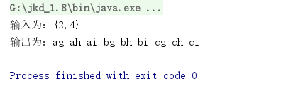
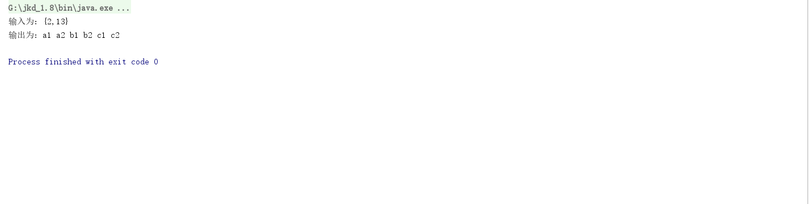

# mini-test
###测试分析结果
* 用LinkedList数据结构实现需求
* 第二个需求使用工厂模式切换数字映射
###构建环境
* 使用jdk1.8 环境
* 使用maven构建
* 使用intelliJ idea编辑工具

###测试
* 第一个需求的测试在包src/test/java/Stage1Test#main方法中可以手动测试,测试结果如图：  
  或者以junit方式执行Stage1Test#test方法测试,测试结果如图：  
    

* 第二个需求的测试在包src/test/java/stage2Test#test9方法中是以9个数字的方式进行测试，测试结果：
    
    stage2Test#test99方法中以99个数字的方式进行测试，测试结果  
    